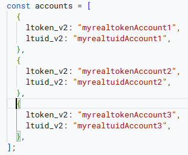

## HoyoLab Auto Login google script

---

How to use (id: cara pakai) :

1. open (id: buka) https://script.google.com

2. click new project (id: klik projek baru)

   

3. copy the index.gs code to app script (id: copy file index.gs ke app script)

   

4. now you need to get your ltoken and ltuid (id: sekarang tinggal ambil ltoken dan ltuid)

5. open [hoyolab](https://www.hoyolab.com/) and make sure you are logged in (id: buka [hoyolab](https://www.hoyolab.com/) dan pastikan sudah login.)

6. press F12 on hoyolab page (id: tekan F12 di page hoyolab)

7. click tab storage[firefox] OR application[chromium based] (klik di tab storage[firefox] atau application[chrome])

   

8. copy value of ltoken_v2 and ltuid_v2 into your app script (id: copy value dari ltoken_v2 dan ltuid_v2 ke google app script)
   

9. [optional] if you have more than 1 account, you need to logout and sign in to hoyolab with your different account and repeat the proccess (id: [opsional] jika punya lebih dari 1 akun, maka perlu logout dari hoyolab kemudian login lagi pake akun yg lain)

example (contoh):
don't forget the commas (id: jgn lupa koma nya ya)

10. last step is setup scheduler on app script (id: langkah terakhir tinggal setup scheduler di app script)

just follow this step (id: tinggal ikuti langkah ini)

---

### remember to choose `mainFunction` at step 4 (id: pada langkah ke 4 jgn lupa pilih `mainFunction`)

---

Done (Selesai)
